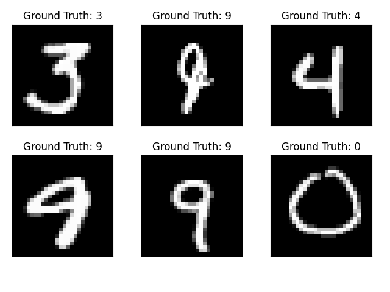
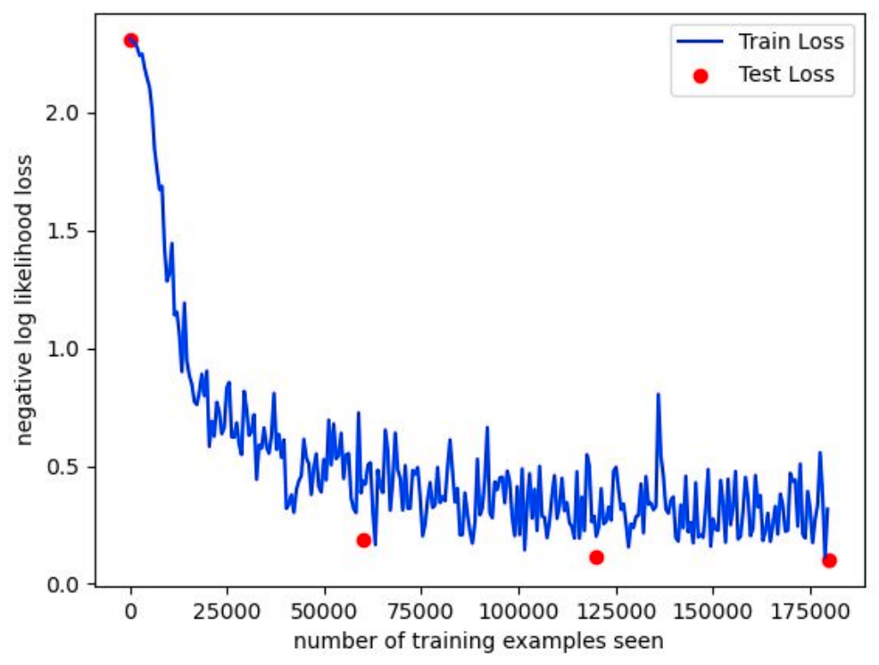

# CSE D 514 Project - Distributed Training using PyTorch

In this project, we
- Investigated different functionalities of PyTorch
- Performed NN training on single machine
- Performed NN training on multiple machines (Distributed Training)
- Did performance comparison of single vs multiple machines

## Dataset used
MNIST dataset was used for this project.  

## GCP and PyTorch setup
Please refer to [this document](GCP_PyTorch_setup.pdf) to set up the environment.

## Results

